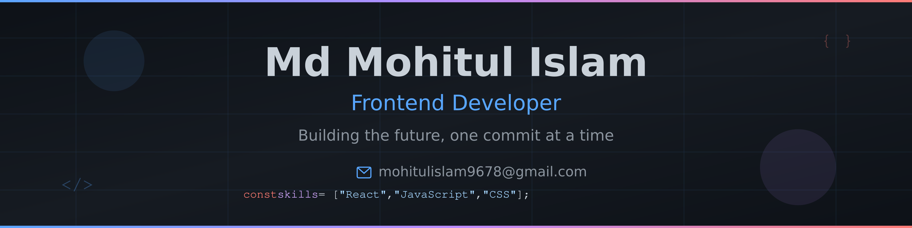

<div align="center">
  
</div>

<h1 align="center">
  
</h1>

<h3 align="center">Passionate Full Stack Developer | Frontend Developer | Based in Gazipur, Bangladesh 🇧🇩</h3>


---

## 🚀 About Me

```javascript
const mohitul = {
    location: "Gazipur, Bangladesh",
    currentFocus: "Building scalable MERN stack applications",
    learning: ["Next.js", "Firebase", "Advanced Backend Architecture"],
    askMeAbout: ["React", "Express", "MongoDB", "Full Stack Development"],
    funFact: "I don't always test my code, but when I do... it's in production 😄",
    email: "mohitulislam9678@gmail.com"
};
```

---

## 💼 What I'm Up To

- 🔭 Currently working on **MERN Stack Projects**
- 🌱 Learning **Next.js, Firebase & Advanced Backend Development**
- 💡 Open to collaborating on **innovative web applications**
- 💬 Let's talk about **React, Express, MongoDB & Full Stack Development**
- 📫 Reach me at **mohitulislam9678@gmail.com**

---

## 🤝 Connect With Me

<p align="center">
  <a href="https://linkedin.com/in/mohitul-islam962" target="_blank">
    
  </a>
  <a href="mailto:mohitulislam9678@gmail.com">
    
  </a>
</p>

---

## 🛠️ Tech Stack

### 💻 Languages
<p align="center">
  
</p>

### 🎨 Frontend Development
<p align="center">
  
</p>

### ⚙️ Backend Development
<p align="center">
  
</p>

### 🗄️ Database
<p align="center">
  
</p>

### ☁️ Backend as a Service (BaaS)
<p align="center">
  
</p>

### 🚀 Deployment & Hosting
<p align="center">
  
</p>

### 🎯 Design Tools
<p align="center">
  
</p>

---


<div align="center">
  
</div>

---

<p align="center">
  <i>⭐️ From <a href="https://github.com/mohitul">Mohitul Islam</a> - Let's build something amazing together!</i>
</p>


<p align="center">
  
</p>
